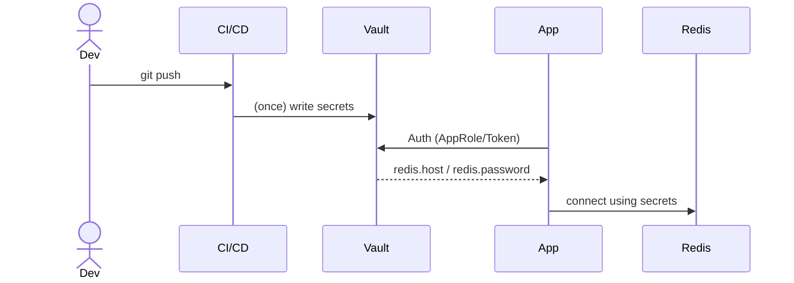

# On‑Premise Key Management Migration Guide: AWS KMS → HashiCorp Vault (Docker 1.17+)

> **목표**  
> AWS KMS 기반 키 관리(암·복호화, 시크릿 저장) 환경을 온프레미스에서 **HashiCorp Vault**로 대체한다.  
> 독립 실행형 **Docker Compose** 예제(개발용)와 **Raft HA 클러스터** 예제(운영용)까지 전체 라이프사이클을 다룬다.

---

## 1. 개요

| 항목 | 요구 사항 |
|------|-----------|
| 벤더 종속성 | X &nbsp;(오픈소스 Vault OSS) |
| 접근 제어 | 세분화된 RBAC 정책 (Token, AppRole) |
| 보안 수준 | AWS KMS와 동등(암호화·감사로그·TLS) |
| 배포 환경 | 온프레미스 Docker / K8s 가능 |
| 가용성 | 초기 `single‑node` → 향후 `raft HA` |
| 환경 분리 | dev / prod 별도 Vault 인스턴스 또는 namespace |

---

## 2. 비즈니스 Flow (Mermaid)



---

## 3. 예상 일정

| 단계 | 주요 작업 | 예상 소요 |
|------|----------|-----------|
| PoC 환경 | Single‑node Vault + Spring Boot 연동 | 0.5 day |
| 정책 설계 | KV path, 정책, 토큰 모델 설계 | 1 day |
| 앱 통합 | Spring Cloud Vault Config 적용 | 1 day |
| HA 구축 | 3‑node Raft cluster + LoadBalancer | 1 day |
| 테스트/문서화 | DR 복구, 성능, Pen‑Test | 1 day |
| **총 합계** |  | **≈ 5 days** |

---

## 4. 개발용 Single‑Node 배포 (Docker Compose)

`docker‑compose.dev.yml`

```yaml
version: "3.9"

services:
  vault:
    image: hashicorp/vault:1.19.0   # 1.17+ 안정 버전
    container_name: vault-dev
    restart: unless-stopped
    ports:
      - "8200:8200"
    environment:
      VAULT_DEV_ROOT_TOKEN_ID: "root-token"
      VAULT_ADDR: "http://127.0.0.1:8200"
    volumes:
      - ./volume/vault/data:/vault/data
    cap_add:
      - IPC_LOCK
```

> `VAULT_DEV_ROOT_TOKEN_ID` 사용 시 **개발 전용**이다.  
> 운영 환경에서는 반드시 `vault operator init` & `unseal` 절차를 수행한다.

### 4.1 초기화 & 시크릿 적재 스크립트

```bash
#!/usr/bin/env bash
set -e
export VAULT_ADDR=http://localhost:8200
export VAULT_TOKEN=root-token

# 1) KV v2 활성화
vault secrets enable -path=secret kv-v2

# 2) Redis 접속 정보 저장
vault kv put secret/redis host=redis.local port=6379 username=app password=Str0ngP@ss!
```

---

## 5. 운영용 3‑Node Raft HA 클러스터

`docker‑compose.prod.yml`

```yaml
version: "3.9"
services:
  vault1:
    image: hashicorp/vault:1.19.0
    hostname: vault1
    restart: unless-stopped
    cap_add: [ "IPC_LOCK" ]
    volumes:
      - ./volume/vault1/data:/vault/data
    networks: [ vault-net ]
    environment:
      VAULT_LOCAL_CONFIG: |
        ui = true
        listener "tcp" {
          address = "0.0.0.0:8200"
          tls_disable = 1
        }
        storage "raft" {
          path    = "/vault/data"
          node_id = "vault1"
        }
        cluster_addr = "http://vault1:8201"

  vault2:
    image: hashicorp/vault:1.19.0
    hostname: vault2
    restart: unless-stopped
    cap_add: [ "IPC_LOCK" ]
    volumes:
      - ./volume/vault2/data:/vault/data
    networks: [ vault-net ]
    environment:
      VAULT_LOCAL_CONFIG: |
        ui = true
        listener "tcp" {
          address = "0.0.0.0:8200"
          tls_disable = 1
        }
        storage "raft" {
          path    = "/vault/data"
          node_id = "vault2"
          retry_join {
            leader_api_addr = "http://vault1:8200"
          }
        }
        cluster_addr = "http://vault2:8201"

  vault3:
    image: hashicorp/vault:1.19.0
    hostname: vault3
    restart: unless-stopped
    cap_add: [ "IPC_LOCK" ]
    volumes:
      - ./volume/vault3/data:/vault/data
    networks: [ vault-net ]
    environment:
      VAULT_LOCAL_CONFIG: |
        ui = true
        listener "tcp" {
          address = "0.0.0.0:8200"
          tls_disable = 1
        }
        storage "raft" {
          path    = "/vault/data"
          node_id = "vault3"
          retry_join {
            leader_api_addr = "http://vault1:8200"
          }
        }
        cluster_addr = "http://vault3:8201"

networks:
  vault-net:
```

> **초기화**: `vault operator init -key-shares=5 -key-threshold=3` 를 *한 번만* 실행 후,  
> `vault operator unseal` 을 3개 노드에 동일하게 3개 키로 수행한다.

### 5.1 로드밸런서 / 프록시

| 레이어 | 예시 구현 | 메모 |
|--------|-----------|------|
| L7 | nginx / HAProxy | `/v1/sys/health` 헬스체크 |
| L4 | keepalived VIP | 내부 네트워크용 |

---

## 6. Spring Boot 연동

### 6.1 의존성

```groovy
implementation 'org.springframework.cloud:spring-cloud-starter-vault-config'
```

### 6.2 `application.yml`

```yaml
spring:
  application:
    name: maestro
  config:
    import: vault://secret
  cloud:
    vault:
      uri: http://vault-gateway:8200
      authentication: TOKEN
      token: ${VAULT_TOKEN}
      kv:
        backend: secret
        default-context: redis   # secret/redis
```

### 6.3 코드 예시

```java
@Configuration
@ConfigurationProperties(prefix = "maestro.data.redis.config")
public record RedisConfig(String host, int port, String username, String password) {}
```

Application start‑up 시 Vault에서 값을 조회하여 `RedisStandaloneConfiguration` 빈에 주입한다.

---

## 7. RBAC 정책 샘플

`policy/redis.hcl`

```
path "secret/data/redis" {
  capabilities = ["read"]
}
```

```bash
vault policy write redis-read policy/redis.hcl
vault token create -policy=redis-read -ttl=24h
```

---

## 8. 보안 고려 사항

* **TLS**: `listener "tcp" { tls_cert_file=… tls_key_file=… }`
* **Audit**: `vault audit enable file file_path=/vault/audit.log`
* **Snapshot & DR**: `vault operator raft snapshot save backup.snap`
* **키 순환**: KV v2 supports versioning & deletes.

---

## 9. AWS KMS → Vault 마이그레이션 절차

| 단계 | 작업 |
|------|------|
| 1 | KMS 키/시크릿 인벤토리 산출 |
| 2 | 필요 시 키 재생성(회전) & 값 Export |
| 3 | Vault KV v2 에 `vault kv put …` |
| 4 | App 설정 변경(`spring.config.import`) |
| 5 | Blue/Green 배포 & 검증 |
| 6 | KMS 키 폐기(보존 정책 준수) |

---

## 10. 참고 자료

* Vault Release 1.19 Notes  
* Spring Cloud Vault Config Data Guide  
* Vault Integrated Storage (Raft) Docs  
* HashiCorp Tutorial: Spring + Vault Secrets Reload  
* Medium: Vault HA Cluster with Raft

---

> 작성: 2025‑06‑23
