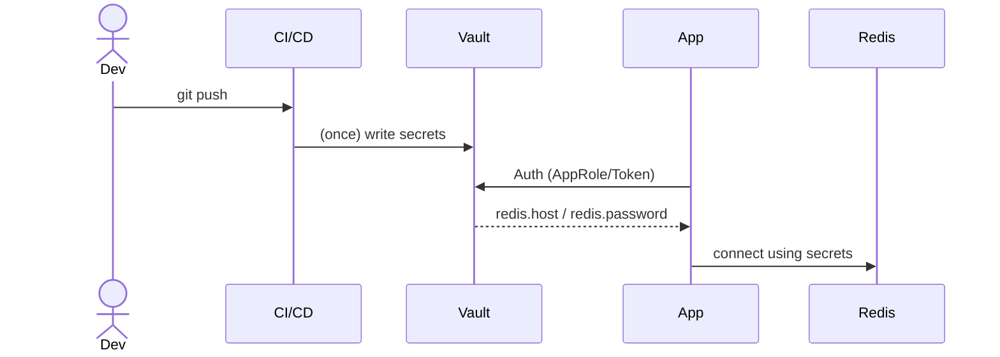

# On‑Premise Key Management Migration Guide: AWS KMS → HashiCorp Vault (Docker 1.17+)

> **업데이트 (2025‑06‑23):**  
> 운영용 **Raft HA 3‑노드** 예제를 *`VAULT_LOCAL_CONFIG` 환경변수* → *외부 HCL 파일* 방식으로 변경하였습니다.  
> `docker‑compose.prod.yml`, `config/vault*.hcl` 모두 상세 주석을 포함합니다.

---

## 1. 개요

| 항목 | 요구 사항 |
|------|-----------|
| 벤더 종속성 | X &nbsp;(오픈소스 Vault OSS) |
| 접근 제어 | 세분화된 RBAC 정책 (Token, AppRole) |
| 보안 수준 | AWS KMS와 동등(암호화·감사로그·TLS) |
| 배포 환경 | 온프레미스 Docker / K8s 가능 |
| 가용성 | 초기 `single‑node` → 향후 `raft HA` |
| 환경 분리 | dev / prod 별도 Vault 인스턴스 또는 namespace |

---

## 2. 비즈니스 Flow (Mermaid)



---

## 3. 예상 일정

| 단계 | 주요 작업 | 예상 소요 |
|------|----------|-----------|
| PoC 환경 | Single‑node Vault + Spring Boot 연동 | 0.5 day |
| 정책 설계 | KV path, 정책, 토큰 모델 설계 | 1 day |
| 앱 통합 | Spring Cloud Vault Config 적용 | 1 day |
| HA 구축 | 3‑node Raft cluster + LoadBalancer | 1 day |
| 테스트/문서화 | DR 복구, 성능, Pen‑Test | 1 day |
| **총 합계** |  | **≈ 5 days** |

---

## 4. 개발용 Single‑Node 배포 (Docker Compose)

`docker‑compose.dev.yml`

```yaml
version: "3.9"

services:
  vault:
    image: hashicorp/vault:1.19.0   # 1.17+ 안정 버전
    container_name: vault-dev
    restart: unless-stopped
    ports:
      - "8200:8200"
    environment:
      VAULT_DEV_ROOT_TOKEN_ID: "root-token"
      VAULT_ADDR: "http://127.0.0.1:8200"
    volumes:
      - ./volume/vault/data:/vault/data
    cap_add:
      - IPC_LOCK
```

> `VAULT_DEV_ROOT_TOKEN_ID` 사용 시 **개발 전용**이다.  
> 운영 환경에서는 반드시 `vault operator init` & `unseal` 절차를 수행한다.

### 4.1 초기화 & 시크릿 적재 스크립트

```bash
#!/usr/bin/env bash
set -e
export VAULT_ADDR=http://localhost:8200
export VAULT_TOKEN=root-token

# 1) KV v2 활성화
vault secrets enable -path=secret kv-v2

# 2) Redis 접속 정보 저장
vault kv put secret/redis host=redis.local port=6379 username=app password=Str0ngP@ss!
```

---

## 5. 운영용 **3‑Node Raft HA 클러스터** (Config 파일 방식)

### 5.1 디렉터리 레이아웃

```
project-root/
├─ docker-compose.prod.yml
└─ config/
   ├─ vault1.hcl
   ├─ vault2.hcl
   └─ vault3.hcl
```

### 5.2 `docker-compose.prod.yml` (주석 포함)

```yaml
version: "3.9"

services:
  # ───────────────────────────────────────────────
  # Vault 1 — Leader 후보
  # ───────────────────────────────────────────────
  vault1:
    image: hashicorp/vault:1.19.0          # ▶︎ 1.17+ 안정 버전
    hostname: vault1                       # ▶︎ 클러스터 내부 식별용
    container_name: vault1
    restart: unless-stopped
    cap_add:
      - IPC_LOCK                           # ▶︎ 메모리 잠금, 성능·보안↑
    volumes:
      - ./config/vault1.hcl:/vault/config/local.hcl:ro  # ▶︎ 설정 파일 마운트 (읽기전용)
      - ./volume/vault1/data:/vault/data                # ▶︎ Raft 스토리지
    networks:
      - vault-net
    ports:
      - "8201:8200"                        # ▶︎ 필요 시 포트 개방 (선택)

  # ───────────────────────────────────────────────
  # Vault 2 — Follower
  # ───────────────────────────────────────────────
  vault2:
    image: hashicorp/vault:1.19.0
    hostname: vault2
    container_name: vault2
    restart: unless-stopped
    cap_add: [ "IPC_LOCK" ]
    volumes:
      - ./config/vault2.hcl:/vault/config/local.hcl:ro
      - ./volume/vault2/data:/vault/data
    networks: [ vault-net ]
    ports:
      - "8202:8200"

  # ───────────────────────────────────────────────
  # Vault 3 — Follower
  # ───────────────────────────────────────────────
  vault3:
    image: hashicorp/vault:1.19.0
    hostname: vault3
    container_name: vault3
    restart: unless-stopped
    cap_add: [ "IPC_LOCK" ]
    volumes:
      - ./config/vault3.hcl:/vault/config/local.hcl:ro
      - ./volume/vault3/data:/vault/data
    networks: [ vault-net ]
    ports:
      - "8203:8200"

networks:
  vault-net:
    driver: bridge                         # ▶︎ 단일 호스트 기준. 멀티노드시 overlay 사용
```

> **왜 Config 파일?**  
> *컴포즈 파일이 길어지지 않고*, TLS·정책 등 복잡한 설정을 하드코딩하지 않아 *가독성*과 *형상관리*에 유리합니다.

### 5.3 `config/vault*.hcl` 샘플 (공통 부분은 동일, node_id·cluster_addr만 변경)

#### `config/vault1.hcl`

```hcl
# ─────────────── UI & Listener ───────────────
ui = true                                       # 웹 UI 활성화

listener "tcp" {
  address     = "0.0.0.0:8200"                  # 컨테이너 내부 포트
  tls_disable = 1                               # 데모용. 운영 시 TLS 필수!
}

# ─────────── Storage (Raft HA) ───────────────
storage "raft" {
  path    = "/vault/data"                       # 데이터 경로 (volume)
  node_id = "vault1"                            # 고유 노드 ID
}

# ─────────── 클러스터 네트워킹 ───────────────
cluster_addr = "http://vault1:8201"
api_addr     = "http://vault1:8200"

# ─────────── Liveness Probe ───────────────
disable_mlock = true                            # 도커 환경에서 mlock 실패 방지
```

#### `config/vault2.hcl`

```hcl
ui = true
listener "tcp" {
  address     = "0.0.0.0:8200"
  tls_disable = 1
}

storage "raft" {
  path    = "/vault/data"
  node_id = "vault2"

  # vault1 리더에게 조인
  retry_join {
    leader_api_addr = "http://vault1:8200"
  }
}

cluster_addr = "http://vault2:8201"
api_addr     = "http://vault2:8200"
disable_mlock = true
```

#### `config/vault3.hcl`

```hcl
ui = true
listener "tcp" { address = "0.0.0.0:8200" tls_disable = 1 }

storage "raft" {
  path    = "/vault/data"
  node_id = "vault3"
  retry_join { leader_api_addr = "http://vault1:8200" }
}

cluster_addr = "http://vault3:8201"
api_addr     = "http://vault3:8200"
disable_mlock = true
```

### 5.4 초기화 & 언실(Unseal)

```bash
# ❶ 단 한 번!  (vault1 컨테이너 대상으로 실행)
docker exec -it vault1 vault operator init -key-shares=5 -key-threshold=3 -format=json > init.json

# ❷ 3개 키로 모든 노드 언실
for k in $(jq -r '.unseal_keys_b64[0:3][]' init.json); do
  for h in vault1 vault2 vault3; do
    docker exec $h vault operator unseal "$k"
  done
done
```
```powershell
docker exec -it vault1 `
  vault operator init `
    -address="http://127.0.0.1:8200" `
    -key-shares=5 `
    -key-threshold=3 `
    -format=json > init.json
```

---

## 6. Spring Boot 연동 · RBAC · 보안 고려사항
*(변경 없음 — 이전 버전 내용 유지)*

---

## 9. AWS KMS → Vault 마이그레이션 절차
*(변경 없음)*

---

> **참고**: `disable_mlock = true` 는 컨테이너에서 `mlock` 제한을 우회하기 위한 설정이다.  
> 실제 운영용 Linux 호스트에서는 `cap_add: IPC_LOCK` + `vm.swappiness=0` 튜닝 후 `disable_mlock`을 제거해 메모리에서 키가 swap 되지 않도록 한다.

---

*문서 버전 v1.1 — 환경변수→Config 파일 전환*
