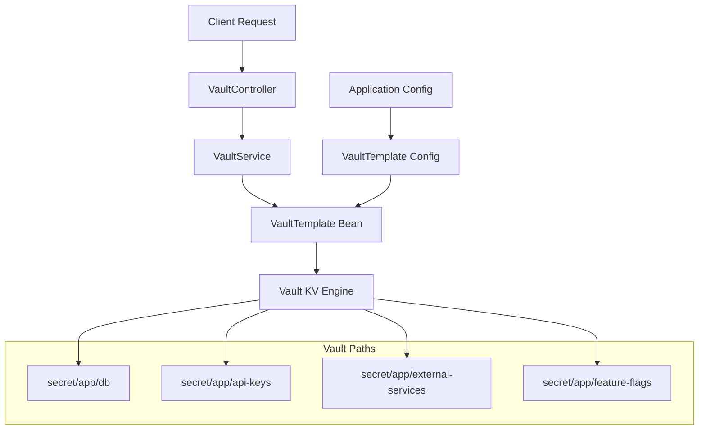

# VaultTemplate을 이용한 독립적 키-밸류 조회 예제 구현 플랜 (Java 17)

## 1. 개요

기존 Vault DB 설정 시나리오북을 확장하여, **VaultTemplate 빈**을 활용한 독립적인 키-밸류 조회 기능을 구현합니다.  
Spring Boot 애플리케이션 실행 중에 필요에 따라 Vault에서 다양한 시크릿을 동적으로 조회할 수 있는 서비스를 제공합니다.

### 목표
- VaultTemplate 빈 구성 및 의존성 주입
- RESTful API를 통한 시크릿 조회 엔드포인트 제공
- 다양한 경로의 키-밸류 데이터 읽기/쓰기 기능
- 에러 핸들링 및 보안 고려사항 적용

### 기술 스택
- **Java 17** (LTS)
- **Spring Boot 3.3.x**
- **Spring Vault 3.1.x**
- **Gradle 8.x**

---

## 2. 아키텍처 확장



---

## 3. 구현 계획

### 3.1 Phase 1: 프로젝트 설정 및 의존성 (30분)

#### Gradle 의존성 추가
```kotlin
// build.gradle.kts
plugins {
    java
    id("org.springframework.boot") version "3.3.0"
    id("io.spring.dependency-management") version "1.1.5"
}

java {
    toolchain {
        languageVersion = JavaLanguageVersion.of(17)
    }
}

ext {
    set("springCloudVersion", "2023.0.0")
}

dependencies {
    // Spring Boot Starters
    implementation("org.springframework.boot:spring-boot-starter-web")
    implementation("org.springframework.boot:spring-boot-starter-validation")
    implementation("org.springframework.boot:spring-boot-starter-actuator")
    
    // Spring Vault
    implementation("org.springframework.cloud:spring-cloud-starter-vault-config")
    implementation("org.springframework.vault:spring-vault-core")
    
    // Utilities
    implementation("org.projectlombok:lombok")
    annotationProcessor("org.projectlombok:lombok")
    
    // Test Dependencies
    testImplementation("org.springframework.boot:spring-boot-starter-test")
    testImplementation("org.testcontainers:junit-jupiter")
    testImplementation("org.testcontainers:vault")
}

dependencyManagement {
    imports {
        mavenBom("org.springframework.cloud:spring-cloud-dependencies:${property("springCloudVersion")}")
    }
}

tasks.withType<Test> {
    useJUnitPlatform()
}
```

#### VaultTemplate 설정 클래스
```kotlin
// 추가적인 Gradle 설정
configurations {
    compileOnly {
        extendsFrom(configurations.annotationProcessor.get())
    }
}

repositories {
    mavenCentral()
}

// Spring Boot 빌드 정보 생성
springBoot {
    buildInfo()
}

// JAR 생성 설정
tasks.jar {
    enabled = false
    archiveClassifier = ""
}

// 실행 가능한 JAR 설정
tasks.bootJar {
    enabled = true
    archiveClassifier = ""
    mainClass.set("com.example.vault.VaultExampleApplication")
}

// 테스트 설정
tasks.test {
    systemProperty("spring.profiles.active", "test")
    finalizedBy(tasks.jacocoTestReport)
}

// 코드 커버리지
apply(plugin = "jacoco")

tasks.jacocoTestReport {
    dependsOn(tasks.test)
    reports {
        xml.required.set(true)
        html.required.set(true)
    }
}
```
```java
@Configuration
@EnableVault
public class VaultConfig {
    
    @Value("${spring.cloud.vault.uri}")
    private String vaultUri;
    
    @Value("${spring.cloud.vault.token}")
    private String vaultToken;
    
    @Bean
    public VaultEndpoint vaultEndpoint() {
        return VaultEndpoint.from(URI.create(vaultUri));
    }
    
    @Bean
    public ClientAuthentication clientAuthentication() {
        return new TokenAuthentication(vaultToken);
    }
    
    @Bean
    public VaultTemplate vaultTemplate(VaultEndpoint vaultEndpoint, 
                                     ClientAuthentication clientAuthentication) {
        return new VaultTemplate(vaultEndpoint, clientAuthentication);
    }
}
```

### 3.2 Phase 2: 서비스 레이어 구현 (45분)

#### VaultService 인터페이스
```java
public interface VaultService {
    
    /**
     * 특정 경로에서 단일 키의 값을 조회
     */
    String getSecret(String path, String key);
    
    /**
     * 특정 경로의 모든 시크릿을 Map으로 조회
     */
    Map<String, Object> getSecretMap(String path);
    
    /**
     * 특정 경로에 시크릿 데이터 저장
     */
    boolean putSecret(String path, Map<String, Object> data);
    
    /**
     * 특정 경로의 시크릿 삭제
     */
    boolean deleteSecret(String path);
    
    /**
     * 시크릿 경로 목록 조회
     */
    List<String> listSecrets(String basePath);
    
    /**
     * 시크릿 버전 히스토리 조회
     */
    List<VaultSecretVersion> getSecretVersions(String path);
}
```

#### VaultServiceImpl 구현
```java
@Service
@Slf4j
public class VaultServiceImpl implements VaultService {
    
    private final VaultTemplate vaultTemplate;
    private final VaultKeyValueOperations keyValueOps;
    
    public VaultServiceImpl(VaultTemplate vaultTemplate) {
        this.vaultTemplate = vaultTemplate;
        this.keyValueOps = vaultTemplate.opsForKeyValue("secret", VaultKeyValueOperationsSupport.KeyValueBackend.KV_2);
    }
    
    @Override
    public String getSecret(String path, String key) {
        try {
            VaultResponse response = keyValueOps.get(path);
            if (response != null && response.getData() != null) {
                Object value = response.getData().get(key);
                return value != null ? value.toString() : null;
            }
            return null;
        } catch (VaultException e) {
            log.error("Vault에서 시크릿 조회 실패 - path: {}, key: {}", path, key, e);
            throw new VaultSecretNotFoundException("시크릿을 찾을 수 없습니다: " + path + "/" + key);
        }
    }
    
    @Override
    public Map<String, Object> getSecretMap(String path) {
        try {
            VaultResponse response = keyValueOps.get(path);
            if (response != null && response.getData() != null) {
                return new HashMap<>(response.getData());
            }
            return Collections.emptyMap();
        } catch (VaultException e) {
            log.error("Vault에서 시크릿 맵 조회 실패 - path: {}", path, e);
            throw new VaultSecretNotFoundException("시크릿 경로를 찾을 수 없습니다: " + path);
        }
    }
    
    @Override
    public boolean putSecret(String path, Map<String, Object> data) {
        try {
            VaultResponse response = keyValueOps.put(path, data);
            log.info("시크릿 저장 완료 - path: {}, version: {}", path, 
                    response.getMetadata().get("version"));
            return true;
        } catch (VaultException e) {
            log.error("Vault에 시크릿 저장 실패 - path: {}", path, e);
            return false;
        }
    }
    
    @Override
    public boolean deleteSecret(String path) {
        try {
            keyValueOps.delete(path);
            log.info("시크릿 삭제 완료 - path: {}", path);
            return true;
        } catch (VaultException e) {
            log.error("Vault에서 시크릿 삭제 실패 - path: {}", path, e);
            return false;
        }
    }
    
    @Override
    public List<String> listSecrets(String basePath) {
        try {
            List<String> paths = keyValueOps.list(basePath);
            return paths != null ? paths : Collections.emptyList();
        } catch (VaultException e) {
            log.error("Vault 경로 목록 조회 실패 - basePath: {}", basePath, e);
            return Collections.emptyList();
        }
    }
    
    @Override
    public List<VaultSecretVersion> getSecretVersions(String path) {
        try {
            VaultMetadataResponse metadata = keyValueOps.getMetadata(path);
            if (metadata != null && metadata.getVersions() != null) {
                return metadata.getVersions().entrySet().stream()
                    .map(entry -> new VaultSecretVersion(
                        Integer.parseInt(entry.getKey()),
                        (String) entry.getValue().get("created_time"),
                        (Boolean) entry.getValue().get("destroyed")
                    ))
                    .sorted(Comparator.comparing(VaultSecretVersion::version).reversed())
                    .toList();
            }
            return Collections.emptyList();
        } catch (VaultException e) {
            log.error("Vault 시크릿 버전 조회 실패 - path: {}", path, e);
            return Collections.emptyList();
        }
    }
}
```

### 3.3 Phase 3: REST API 컨트롤러 (30분)

#### VaultController
```java
@RestController
@RequestMapping("/api/vault")
@Validated
@Slf4j
public class VaultController {
    
    private final VaultService vaultService;
    
    public VaultController(VaultService vaultService) {
        this.vaultService = vaultService;
    }
    
    @GetMapping("/secrets/{path}/{key}")
    public ResponseEntity<SecretResponse> getSecret(
            @PathVariable String path,
            @PathVariable String key) {
        
        log.info("시크릿 조회 요청 - path: {}, key: {}", path, key);
        
        String value = vaultService.getSecret(path, key);
        if (value != null) {
            SecretResponse response = new SecretResponse(path, key, value);
            return ResponseEntity.ok(response);
        } else {
            return ResponseEntity.notFound().build();
        }
    }
    
    @GetMapping("/secrets/{path}")
    public ResponseEntity<Map<String, Object>> getSecretMap(
            @PathVariable String path) {
        
        log.info("시크릿 맵 조회 요청 - path: {}", path);
        
        Map<String, Object> secrets = vaultService.getSecretMap(path);
        return ResponseEntity.ok(secrets);
    }
    
    @PostMapping("/secrets/{path}")
    public ResponseEntity<StatusResponse> putSecret(
            @PathVariable String path,
            @Valid @RequestBody Map<String, Object> secretData) {
        
        log.info("시크릿 저장 요청 - path: {}", path);
        
        boolean success = vaultService.putSecret(path, secretData);
        StatusResponse response = new StatusResponse(success, 
            success ? "시크릿이 성공적으로 저장되었습니다." : "시크릿 저장에 실패했습니다.");
        
        return success ? ResponseEntity.ok(response) : ResponseEntity.internalServerError().body(response);
    }
    
    @DeleteMapping("/secrets/{path}")
    public ResponseEntity<StatusResponse> deleteSecret(@PathVariable String path) {
        
        log.info("시크릿 삭제 요청 - path: {}", path);
        
        boolean success = vaultService.deleteSecret(path);
        StatusResponse response = new StatusResponse(success,
            success ? "시크릿이 성공적으로 삭제되었습니다." : "시크릿 삭제에 실패했습니다.");
        
        return success ? ResponseEntity.ok(response) : ResponseEntity.internalServerError().body(response);
    }
    
    @GetMapping("/list/{basePath}")
    public ResponseEntity<List<String>> listSecrets(@PathVariable String basePath) {
        
        log.info("시크릿 목록 조회 요청 - basePath: {}", basePath);
        
        List<String> paths = vaultService.listSecrets(basePath);
        return ResponseEntity.ok(paths);
    }
    
    @GetMapping("/versions/{path}")
    public ResponseEntity<List<VaultSecretVersion>> getSecretVersions(@PathVariable String path) {
        
        log.info("시크릿 버전 조회 요청 - path: {}", path);
        
        List<VaultSecretVersion> versions = vaultService.getSecretVersions(path);
        return ResponseEntity.ok(versions);
    }
}
```

### 3.4 Phase 4: DTO 및 응답 모델 (15분)

#### 응답 DTO 정의
```java
// Record를 사용한 불변 DTO (Java 17 feature)
public record SecretResponse(
    String path,
    String key,
    String value,
    LocalDateTime timestamp
) {
    public SecretResponse(String path, String key, String value) {
        this(path, key, value, LocalDateTime.now());
    }
}

public record StatusResponse(
    boolean success,
    String message,
    LocalDateTime timestamp
) {
    public StatusResponse(boolean success, String message) {
        this(success, message, LocalDateTime.now());
    }
}

public record VaultSecretVersion(
    int version,
    String createdTime,
    boolean destroyed
) {}

public record ErrorResponse(
    String error,
    String message,
    String path,
    LocalDateTime timestamp
) {
    public ErrorResponse(String error, String message, String path) {
        this(error, message, path, LocalDateTime.now());
    }
}

// 요청 DTO
public class SecretRequest {
    
    @NotBlank(message = "키는 필수입니다")
    private String key;
    
    @NotBlank(message = "값은 필수입니