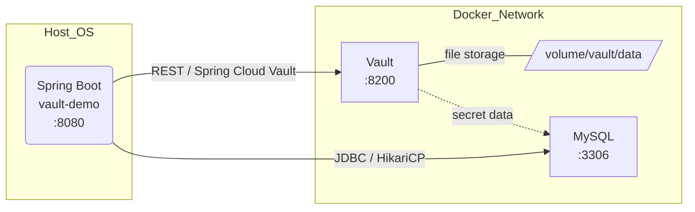

# Vault 기반 Spring Application 서버 아키텍처 가이드 (개발 환경)

## 1. 개요
이 문서는 **Vault → Spring Boot → MySQL**로 이어지는 시크릿 흐름을 포함하여,
`application.yml`, `docker-compose.yml`, `vault_config.hcl` 세 파일이 조합될 때의 
전체 서버 아키텍처를 설명합니다. 개발·테스트 환경을 가정하지만, 운영 환경으로의 
확장 포인트도 함께 명시합니다.

## 2. 구성 요소
| 레이어 | 구성 요소 | 목적 | 주요 포트 |
| ------ | -------- | ---- | --------- |
| Infrastructure | Docker (Compose) | 컨테이너 오케스트레이션 | - |
| Secrets Mgmt | Vault `hashicorp/vault:1.17` | KV v2 시크릿 저장 & 토큰 발급 | **8200** |
| Application | Spring Boot **`vault‑demo`** | REST API, Vault 연동 | **8080** |
| Data Store | MySQL 8.4 | 애플리케이션 데이터베이스 | **3306** |

## 3. 시크릿 흐름
1. **Vault** 컨테이너는 `file` 스토리지를 사용해 `./volume/vault/data`에 암호화 데이터를 저장합니다.  
2. Spring Boot 기동 시 `spring.config.import`가 다음 순서로 실행됩니다.  
   ① `.env` (옵션) → ② `vault://secret/local/config` (KV v2)  
3. Vault URI(`http://localhost:8200`)와 인증 토큰(`VAULT_TOKEN`)을 이용해 **Spring Cloud Vault**가 
   시크릿을 조회하고, `${database.username}`·`${database.password}` 등 플레이스홀더를 해석합니다.  
4. 해석된 값으로 **HikariCP** 데이터소스가 초기화되어 **MySQL**에 접속합니다.

## 4. 인프라 다이어그램 (Mermaid)


## 5. 주요 파일·경로·환경 변수
| 항목 | 위치 | 설명 |
| ---- | ---- | ---- |
| `VAULT_TOKEN` | Host / CI Secret | Spring 앱의 Vault 인증 토큰 |
| `./env/mysql.env` | Host file | MySQL 초기화 변수 |
| `./volume/vault/config/vault_config.hcl` | Host file | Vault 서버 설정 |
| `./volume/vault/data` | Host dir | Vault file 스토리지 |
| `./volume/mysql/data` | Host dir | MySQL 데이터 |

## 6. 기동 절차 (개발 환경)
```bash
# 1) Vault & MySQL 컨테이너 기동
docker compose up -d

# 2) (최초 1회) Vault 초기화 & Unseal & KV 활성화
./scripts/vault_init.sh

# 3) Spring 애플리케이션 실행
export VAULT_TOKEN=<app_token>
./gradlew bootRun      # 또는 java -jar build/libs/vault-demo.jar
```

## 7. 보안 및 운영 확장 포인트
- **TLS 활성화** : 운영 환경에서는 `listener "tcp"` 블록에 TLS 인증서를 지정해야 합니다.  
- **mlock** : 컨테이너가 아닌 환경에서는 `disable_mlock = false`로 두고 OS capabilities를 설정하세요.  
- **스토리지 백엔드** : `file` → `raft`, `postgresql` 등으로 교체해 고가용성(HA) 및 스냅샷 백업을 지원할 수 있습니다.  
- **오케스트레이션** : Docker Compose를 Docker Swarm이나 Kubernetes로 쉽게 확장할 수 있습니다.

## 8. 트러블슈팅 체크리스트
| 증상 | 원인 & 해결 |
| ---- | ---------- |
| Spring 부트 시 `database.*` 속성이 비어 있음 | ① Vault KV 경로 확인<br/>② VAULT_TOKEN 적절한지 확인<br/>③ `spring.cloud.vault.kv.enabled=true` |
| Vault 컨테이너 재시작 후 `sealed` 상태 | 미리 저장해둔 unseal 키로 `vault operator unseal` |
| MySQL 접속 지연 | Docker 볼륨 I/O 확인 & `hikari` 최대 풀 사이즈 조정 |

---

**문서 버전:** 2025-06-23 07:30:07  \| **작성자:** ChatGPT (o3)
